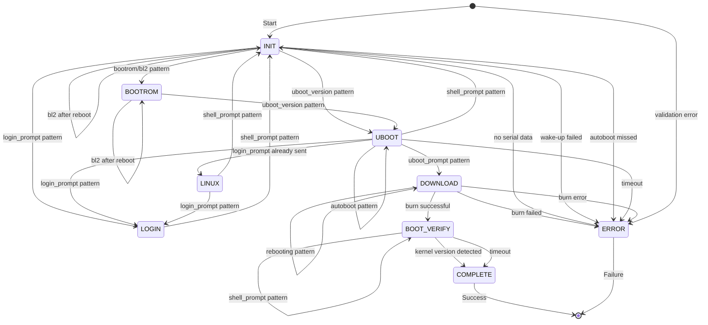

# Amlogic Burn Tool

Event-driven Finite State Machine (FSM) based automated image flashing tool for Amlogic-based SBCs.

## Features

- **Event-driven FSM**: Pattern-based state detection and automated command sending
- **Serial port monitoring**: Continuous reading and pattern matching from serial output
- **Automated U-Boot interaction**: Stops autoboot, enters download mode
- **Relay control**: Optional Tasmota-based relay control for power cycling
- **Comprehensive logging**: Three separate log files with millisecond timestamps
- **Pre-flight checks**: Validates serial port availability and relay connectivity

## Requirements

- Python 3.8+
- pyserial
- requests
- sudo access for `adnl_burn_pkg` tool

## Installation

```bash
pip install -r requirements.txt
```

## Configuration

Before first use, you need to create a configuration file. The tool searches for `aml-burn-tool-config.json` in two locations (in order):

1. **Local (recommended for testing)**: Same directory as the script
2. **System-wide**: `/etc/aml-burn-tool/aml-burn-tool-config.json`

**To set up configuration:**

```bash
# Option 1: Local configuration (script directory)
cp aml-burn-tool-config.json.example aml-burn-tool-config.json
# Edit aml-burn-tool-config.json with your settings

# Option 2: System-wide configuration (requires root)
sudo mkdir -p /etc/aml-burn-tool
sudo cp aml-burn-tool-config.json.example /etc/aml-burn-tool/aml-burn-tool-config.json
sudo nano /etc/aml-burn-tool/aml-burn-tool-config.json
```

**Configuration file format:**

```json
{
  "serial_port": "/dev/serial-polaris",
  "baudrate": 921600,
  "relay_ip": "192.168.1.220",
  "default_image": "polaris.img"
}
```

- `serial_port` (required): Serial port device node (e.g., `/dev/ttyUSB0`, `/dev/serial-polaris`)
- `baudrate` (required): Serial port baudrate (e.g., `921600`, `115200`)
- `relay_ip` (optional): Tasmota relay IP address for automatic power cycling
- `default_image` (optional): Default image file path if `--image` argument is not provided

**Note:** Command-line arguments override config file values. For example, `--relay 192.168.1.100` will override the `relay_ip` from config.

## Usage

### Basic usage (uses config file values):

```bash
./aml-burn-tool.py
```

This uses values from your configuration file. If config file is not found, the script will exit with an error.

### With custom image file:

```bash
./aml-burn-tool.py --image polaris.img
```

### With relay control (recommended for automated power cycling):

```bash
./aml-burn-tool.py --relay 192.168.1.220
```

### With custom serial port:

```bash
./aml-burn-tool.py --serial /dev/ttyUSB0 --baudrate 921600
```

### Full example with all parameters:

```bash
./aml-burn-tool.py \
  --serial /dev/serial-polaris \
  --baudrate 921600 \
  --relay 192.168.1.220 \
  --image polaris.img
```

### Help:

```bash
./aml-burn-tool.py --help
```

## Command Line Arguments

- `--serial`: Serial port device (default: `/dev/serial-polaris`)
- `--baudrate`: Serial port baudrate (default: `921600`)
- `--relay`: Tasmota relay IP address (optional)
- `--image`: Image file path (default: `polaris.img`)

## Workflow

1. **Pre-flight checks**:
   - Validates serial port exists and is not in use
   - Checks relay connectivity (if configured)
   - Verifies image file exists

2. **Power cycle** (if relay configured):
   - Turns power OFF → waits 3 seconds
   - Turns power ON → waits 5 seconds

3. **Boot monitoring**:
   - Monitors serial output for boot patterns
   - Detects U-Boot autoboot message
   - Sends Enter to stop autoboot

4. **Enter download mode**:
   - Waits for U-Boot prompt (`s4_polaris#` or `=>`)
   - Sends `adnl` command
   - Serial port remains open (USB and serial work simultaneously)

5. **Image flashing**:
   - Runs `sudo adnl_burn_pkg -p <image> -r 1`
   - Captures and logs all output
   - Monitors for "burn successful" message

6. **Completion**:
   - Board automatically reboots after successful burn
   - Script completes and saves logs

## State Machine

The tool uses an event-driven FSM with the following states:

- `INIT`: Initial state, waiting for boot
- `BOOTROM`: BootROM/BL2 detected
- `UBOOT`: U-Boot detected, waiting for prompt
- `DOWNLOAD`: Download mode entered, running adnl_burn_pkg
- `LINUX`: Linux booted, login prompt detected
- `LOGIN`: Login sent, waiting for shell prompt
- `BOOT_VERIFY`: Verifying successful boot after burn
- `COMPLETE`: Burn completed successfully
- `ERROR`: Error occurred

### Detailed State Machine Flow

The following diagram shows the complete state machine with all transitions and triggers:



### State Transition Details

#### INIT State
- **Entry**: Initial state when script starts
- **Transitions**:
  - `bootrom/bl2` pattern → **BOOTROM**: Bootloader detected
  - `uboot_version/uboot_prompt` pattern → **UBOOT**: U-Boot detected
  - `login_prompt` pattern → **LOGIN**: Send "root" login
  - `shell_prompt` pattern → **INIT**: Send "reboot -f", reset flags
  - `bl2/bl31/bl32` after reboot → **INIT**: Start continuous Enter to catch autoboot
- **Special Actions**:
  - After reboot, detects bootloader stages and starts continuous Enter sending (1ms interval)
  - Handles relay-less mode wake-up sequence (Enter → Ctrl+C+Enter)

#### BOOTROM State
- **Entry**: BootROM or BL2 bootloader detected
- **Transitions**:
  - `uboot_version` pattern → **UBOOT**: U-Boot bootloader detected
  - `bl2/bl31/bl32` after reboot → **BOOTROM**: Start continuous Enter
- **Purpose**: Intermediate state during bootloader stages

#### UBOOT State
- **Entry**: U-Boot detected or U-Boot prompt seen
- **Transitions**:
  - `autoboot` pattern → **UBOOT**: Send Enter immediately to stop autoboot
  - `uboot_prompt` pattern → **DOWNLOAD**: Send "adnl" command (only once)
  - `login_prompt` pattern → **LOGIN/LINUX**: Send "root" login
  - `shell_prompt` pattern → **INIT**: Send "reboot -f", reset flags
- **Special Actions**:
  - After reboot, stops continuous Enter when prompt detected
  - Sends "adnl" command only once (tracked by `adnl_sent` flag)

#### DOWNLOAD State
- **Entry**: "adnl" command sent, download mode entered
- **Transitions**:
  - `usb_reset` pattern → **DOWNLOAD**: USB download mode active (monitoring)
  - `rebooting` pattern → **DOWNLOAD**: Board rebooting after burn (expected)
  - adnl_burn_pkg success → **BOOT_VERIFY**: Reset flags, verify boot
  - adnl_burn_pkg failure → **ERROR**: Burn failed
- **Special Actions**:
  - Runs `sudo adnl_burn_pkg -p <image> -r 1` asynchronously
  - Monitors for "burn successful" message
  - Serial port remains open during burn process
  - `-r 1` flag automatically reboots board after successful burn

#### BOOT_VERIFY State
- **Entry**: adnl_burn_pkg completed successfully
- **Transitions**:
  - `login_prompt` pattern → **BOOT_VERIFY**: Send "root" login
  - `shell_prompt` pattern → **BOOT_VERIFY**: Send "uname -a" to verify kernel
  - Kernel version detected → **COMPLETE**: Boot verified successfully
  - Timeout (30s) → **COMPLETE**: With warning message
- **Purpose**: Verify that board booted successfully after burn

#### LINUX State
- **Entry**: Linux login prompt detected (from UBOOT state)
- **Transitions**:
  - `login_prompt` pattern → **LOGIN**: Send "root" login
  - `shell_prompt` pattern → **INIT**: Send "reboot -f", reset flags
- **Purpose**: Handle case where board boots to Linux instead of U-Boot

#### LOGIN State
- **Entry**: Login sent, waiting for shell prompt
- **Transitions**:
  - `shell_prompt` pattern → **INIT**: Send "reboot -f", reset flags
- **Purpose**: Handle login process and reboot to get back to U-Boot

#### COMPLETE State
- **Entry**: Boot verification successful or timeout
- **Exit**: Script completes successfully
- **Purpose**: Final success state

#### ERROR State
- **Entry**: Any error condition detected
- **Exit**: Script exits with error code
- **Error Conditions**:
  - Image file not found or invalid
  - Serial port errors
  - Relay connectivity errors
  - adnl_burn_pkg failures
  - Timeouts (no serial data, U-Boot prompt not detected)
  - Wake-up sequence failures (relay-less mode)

### Pattern Detection

The following patterns trigger state transitions:

- **`autoboot`**: "Hit any key to stop autoboot" → Triggers immediate Enter
- **`uboot_prompt`**: U-Boot prompt (`s4_polaris#`, `=>`, `U-Boot>`) → Enter download mode
- **`uboot_version`**: "U-Boot X.Y" → U-Boot detected
- **`login_prompt`**: "login:" → Send root login
- **`shell_prompt`**: "root@hostname:~#" → Linux shell detected
- **`bootrom`**: "chip_family_id" or "ops_bining" → BootROM detected
- **`bl2`**: "BL2" or "BL2E" bootloader messages → Bootloader stage
- **`bl31`**: "BL31" messages → TrustZone bootloader
- **`bl32`**: "BL32" or "BL3-2" messages → Secure OS
- **`usb_reset`**: "USB RESET" → USB download mode active
- **`rebooting`**: "Rebooting." or "Restarting system" → Board rebooting

## Pattern Detection

The tool detects the following patterns in serial output:

- `autoboot`: "Hit any key to stop autoboot"
- `uboot_prompt`: U-Boot prompt (`s4_polaris#`, `=>`, etc.)
- `login_prompt`: Linux login prompt
- `shell_prompt`: Shell prompt (`root@...:~#`)
- `uboot_version`: U-Boot version string
- `bl2`: BL2/BL2E bootloader messages
- `bootrom`: BootROM messages
- `usb_reset`: USB reset messages
- `rebooting`: Reboot messages

## Log Files

All logs are saved to `logs/` directory with timestamps:

- `serial_YYYYMMDD_HHMMSS.log`: All serial port output
- `adnl_YYYYMMDD_HHMMSS.log`: adnl_burn_pkg tool output
- `script_YYYYMMDD_HHMMSS.log`: Script execution logs

All logs include millisecond-precision timestamps.

## Error Handling

- **Serial port in use**: Checks for other processes (minicom, screen) and reports PIDs
- **Relay connectivity**: Validates relay is reachable before use
- **Timeout**: 5-minute timeout for inactivity (warnings every 5 seconds if no data)
- **Image file**: Validates image file exists before starting
- **No serial data**: Warns if no data received for 5+ seconds

## Troubleshooting

### Script hangs after opening serial port

If the script appears to hang after "Serial port opened", check:

1. **Board is powered on**: Ensure the board has power
2. **Serial connection**: Verify USB-to-serial cable is connected
3. **Serial port permissions**: Check if user has access to serial port
   ```bash
   ls -l /dev/serial-polaris
   sudo usermod -a -G dialout $USER  # Then logout/login
   ```
4. **Other processes**: Make sure no other process is using the serial port
   ```bash
   lsof /dev/serial-polaris
   pkill minicom
   pkill screen
   ```

The script will log detailed status every 5 seconds, including:
- Current state
- Elapsed time since last activity
- Number of lines received from serial port
- Serial reader status

### No serial data received

If you see "No serial data received" warnings:

1. Check serial cable connection
2. Verify board is powered on
3. Check baudrate matches board configuration
4. Try different serial port: `--serial /dev/ttyUSB0`

## Notes

- The tool automatically handles the case where board boots to Linux instead of U-Boot:
  - Detects login prompt
  - Sends `root` login
  - Sends `reboot -f` to restart
  - Waits for U-Boot and sends `adnl` again

- Serial port remains open during `adnl_burn_pkg` execution:
  - USB and serial port work simultaneously
  - Burn process outputs progress to serial port (USB RESET, OEM commands, flash progress)
  - All serial output during burn is captured and logged

- The `-r 1` flag to `adnl_burn_pkg` automatically reboots the board after successful burn

## Example Output

```
============================================================
Amlogic Burn Tool Starting
Serial port: /dev/serial-polaris
Baudrate: 921600
Image: polaris.img
Relay IP: 192.168.1.220
============================================================
INFO: Serial port opened: /dev/serial-polaris
INFO: Power cycling board via relay...
INFO: State transition: INIT -> BOOTROM (BootROM/BL2 detected)
INFO: State transition: BOOTROM -> UBOOT (U-Boot detected)
INFO: Sent Enter to stop autoboot
INFO: State transition: UBOOT -> DOWNLOAD (Entered download mode)
INFO: Starting adnl_burn_pkg with image: polaris.img
INFO: [adnl] burn successful^_^
INFO: State transition: DOWNLOAD -> COMPLETE (Burn completed successfully)
INFO: ============================================================
INFO: Burn process completed successfully!
INFO: Logs saved to: logs/
============================================================
```

